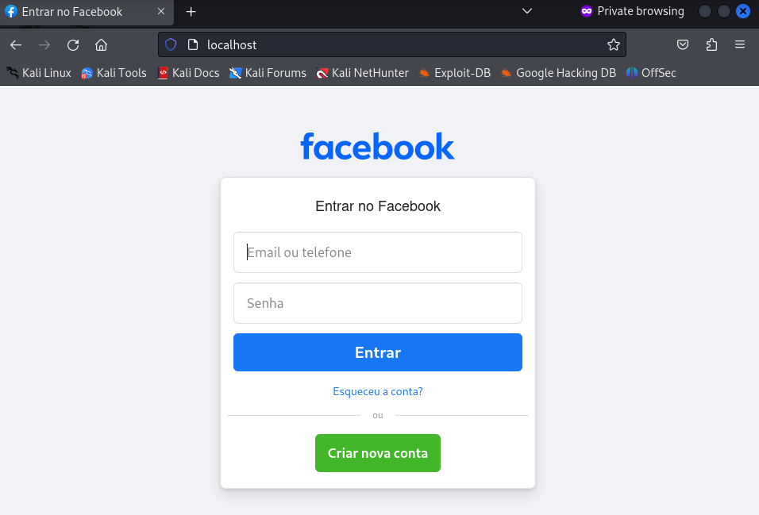
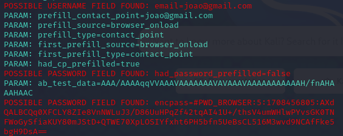

# dio-desafio-phishing
Projeto do programa Formação Cybersecurity Specialist da DIO.me

1. Comando para acessar o root e comando setoolkit:

2. Execução setoolkit e escolha do tipo de ataque:

3. Escolha do vetor de ataque:

4. Escolha dos métodos de ataque:

5. Execução do ataque:

